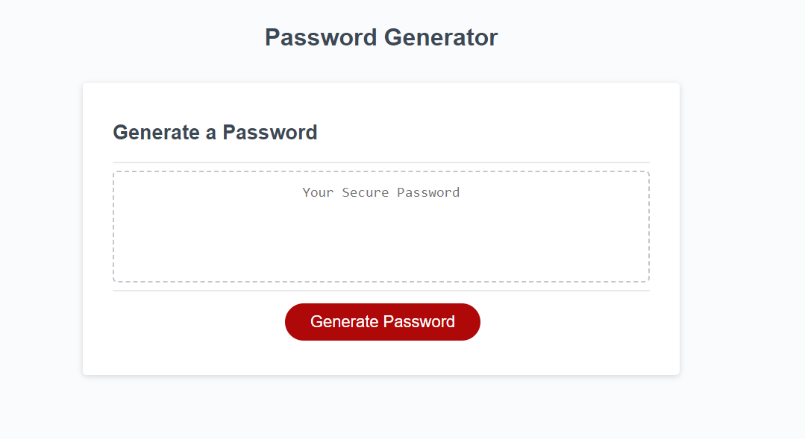

# Password Generator

## Description

I created this password generator in order to have an easy way to randomly create strong passwords. It is a simple page with a button the user selects to begin the process. When the user clicks on the generate passoword button they will be prompted to enter in a desired length of password with the condition that it must be between 8-128 characters. They will also be asked if they want to include lowercase, uppercase, numeric and special characters in their password. If the length is an invalid entry or at least one character type is not selected they will see an alert pop up telling them why their request failed and how to make the right selections and entries.

## Features
- Gnerates strong random passwords.
- Lets user decide the length and what characters are used.
- Will alert user when invaild selections are made.

*Preview of my work*

Technology Used         | Resource URL           | 
| ------------- |:-------------:| 
| HTML       | [https://developer.mozilla.org/en-US/docs/Web/HTML](https://developer.mozilla.org/en-US/docs/Web/HTML) | 
| CSS        | [https://developer.mozilla.org/en-US/docs/Web/CSS](https://developer.mozilla.org/en-US/docs/Web/CSS)      |   
| Git        | [https://git-scm.com/](https://git-scm.com/)     |    
| JavaScript | [https://developer.mozilla.org/en-US/docs/Web/JavaScript](https://developer.mozilla.org/en-US/docs/Web/JavaScript) |
 [Visit the Deployed Site](https://andrewchall92.github.io/password-generator/)

 ## License
 This project is licensed under the [MIT License](LICENSE).